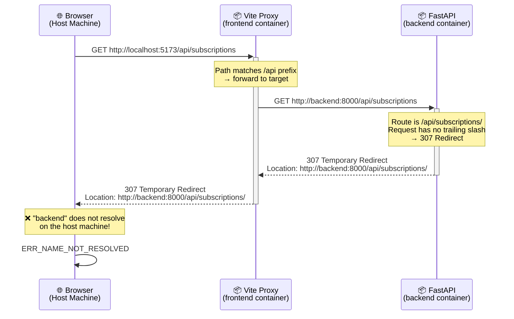
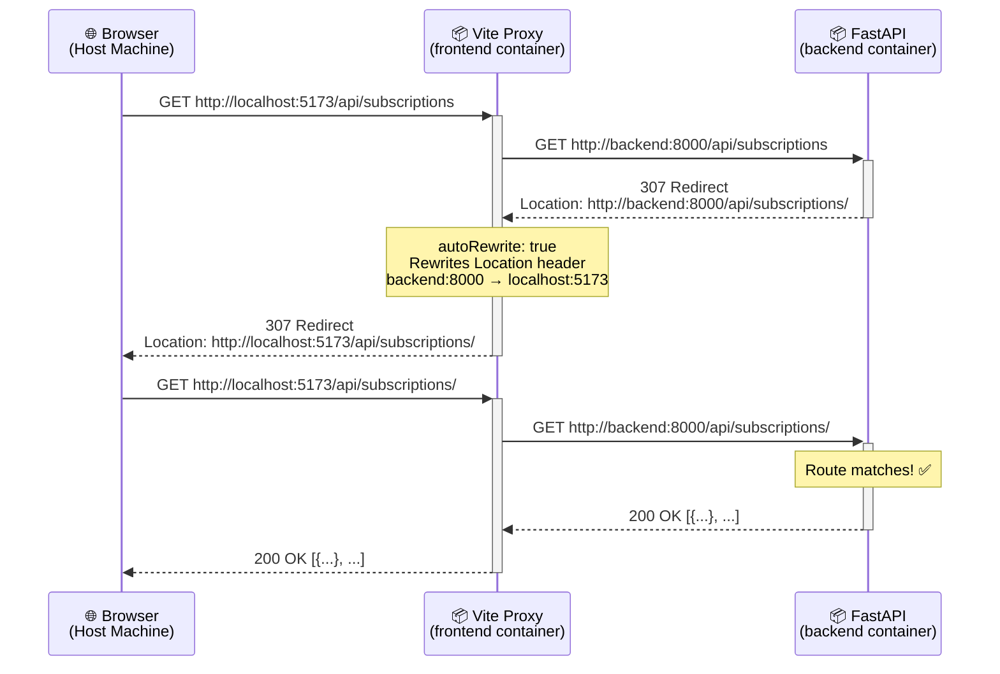
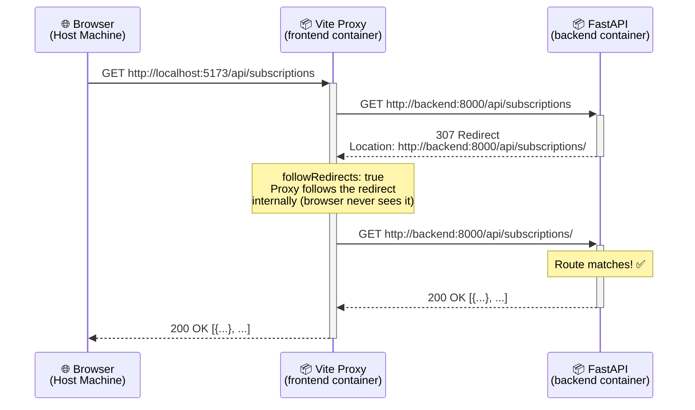

# The 307 Redirect Trap: When Docker, Vite Proxy, and FastAPI Collide

> How a  seemingly  correct proxy configuration can break your app — and the one-line fix that saves it.

## The Setup

You have a typical modern web stack running in Docker Compose:

- **Frontend**: React + Vite dev server (container: `sentinel-frontend`, port 5173)
- **Backend**: FastAPI (container: `backend`, port 8000)
- **Others**: PostgreSQL, Redis, Celery workers

The frontend uses Vite's built-in proxy to forward `/api/*` requests to the backend, avoiding CORS issues during development.

```yaml
# docker-compose.yml
services:
  backend:
    build: ...
    container_name: backend
    ports:
      - "8000:8000"

  frontend:
    build: ...
    container_name: sentinel-frontend
    environment:
      - VITE_API_TARGET=http://backend:8000
    ports:
      - "5173:5173"
```

```typescript
// vite.config.ts
export default defineConfig({
  server: {
    proxy: {
      "/api": {
        target: process.env.VITE_API_TARGET || "http://localhost:8000",
        changeOrigin: true,
        ws: true,
      },
    },
  },
});
```

This looks correct. The frontend container resolves `backend` via Docker's internal DNS. Requests to `/api/*` are proxied. What could go wrong?

---

## The Symptom

You open the app at `http://localhost:5173`. The browser's DevTools show:

| #   | Request                                       | Status                         |
| --- | --------------------------------------------- | ------------------------------ |
| 1   | `GET http://localhost:5173/api/subscriptions` | 307 Temporary Redirect         |
| 2   | `GET http://backend:8000/api/subscriptions/`  | Failed (ERR_NAME_NOT_RESOLVED) |

The first request goes through the proxy successfully. But the response is a **redirect**, and the browser tries to follow it to `http://backend:8000/...` — a hostname that only exists inside Docker's network, not on your host machine.

---

## Understanding the Three Layers

To understand why this happens, we need to examine how three independent systems interact.

### Layer 1: FastAPI's Trailing Slash Redirect

FastAPI (via Starlette) enforces a convention: if you define a route **with** a trailing slash, and a client requests it **without** one, FastAPI automatically responds with a `307 Temporary Redirect`.

```python
# subscriptions.py
router = APIRouter(prefix="/subscriptions", tags=["subscriptions"])

@router.get("/", response_model=list[SubscriptionResponse])
async def list_subscriptions(db: AsyncSession = Depends(get_db)):
    ...
```

```python
# main.py
app.include_router(subscriptions_router, prefix="/api")
```

The registered route is `/api/subscriptions/` (with trailing slash). When a request arrives for `/api/subscriptions` (no slash), FastAPI sends:

```http
HTTP/1.1 307 Temporary Redirect
Location: http://backend:8000/api/subscriptions/
```

FastAPI constructs this URL using the `Host` header it receives. Since the proxy sent the request to `backend:8000`, that's the host FastAPI uses.

### Layer 2: Vite's Proxy (http-proxy)

Vite uses [`http-proxy`](https://github.com/http-party/node-http-proxy) under the hood. By default, the proxy is a **transparent pipe** — it forwards the backend's response headers to the browser exactly as received.

This means the `Location: http://backend:8000/api/subscriptions/` header is passed directly to the browser.

### Layer 3: The Browser

The browser receives the 307 redirect and obediently tries to navigate to `http://backend:8000/api/subscriptions/`. But on the host machine, `backend` is not a valid hostname. The request fails with `ERR_NAME_NOT_RESOLVED`.

---

## The Full Picture

Here's the complete sequence diagram showing what happens:



---

## Why This Only Happens in Docker

In local development (no Docker), both the frontend and backend run on `localhost`:

- Backend thinks it's at `localhost:8000`
- Redirect points to `http://localhost:8000/api/subscriptions/`
- Browser can reach `localhost:8000` → **it works**

In Docker, the backend thinks it's at `backend:8000` (its container hostname). This internal name **leaks** through the redirect's `Location` header into the browser, which lives outside Docker's network.

---

## The Fixes

Vite's proxy (powered by `http-proxy`) provides two options that each solve this problem, but in fundamentally different ways.

### Fix A: `autoRewrite` — Edit the Letter

The `autoRewrite` option rewrites the `Location` header in redirect responses. It replaces the backend's host/port with the proxy's host/port, so the browser always redirects back through the proxy.

```typescript
// vite.config.ts
export default defineConfig({
  server: {
    proxy: {
      "/api": {
        target: process.env.VITE_API_TARGET || "http://localhost:8000",
        changeOrigin: true,
        ws: true,
        autoRewrite: true, // ← Rewrite the Location header
      },
    },
  },
});
```

With `autoRewrite: true`, the sequence becomes:



The proxy intercepts the redirect, rewrites `backend:8000` to `localhost:5173`, and returns the rewritten response to the browser. The browser follows the redirect back through the proxy, which forwards it to the backend again — this time with the trailing slash, so it matches the route directly.

**Key characteristic:** The browser still sees the 307 redirect in DevTools (two requests visible).

### Fix B: `followRedirects` — Run the Errand Yourself

The `followRedirects` option takes a completely different approach. Instead of passing the redirect back to the browser, the proxy **follows the redirect internally**. The browser never knows a redirect happened.

```typescript
// vite.config.ts
export default defineConfig({
  server: {
    proxy: {
      "/api": {
        target: process.env.VITE_API_TARGET || "http://localhost:8000",
        changeOrigin: true,
        ws: true,
        followRedirects: true, // ← Follow redirects internally
      },
    },
  },
});
```

With `followRedirects: true`, the sequence becomes:



The proxy handles both requests to the backend itself. From the browser's perspective, there was only one request and one response — the redirect is completely invisible.

**Key characteristic:** The browser only sees one request in DevTools (the redirect is hidden).

### Comparing the Two Fixes

| Aspect                     | `autoRewrite`                                                                   | `followRedirects`                                             |
| -------------------------- | ------------------------------------------------------------------------------- | ------------------------------------------------------------- |
| **Analogy**                | Edit the letter before giving it to the mailman                                 | The mailman runs the extra errand himself                     |
| **Browser sees redirect?** | Yes (2 requests in DevTools)                                                    | No (1 request in DevTools)                                    |
| **Network round-trips**    | Browser → Proxy → Backend → Proxy → Browser → Proxy → Backend → Proxy → Browser | Browser → Proxy → Backend → Proxy → Backend → Proxy → Browser |
| **Debugging**              | Easier (you can see the redirect)                                               | Harder (redirect is hidden)                                   |
| **Performance**            | Slightly slower (extra browser↔proxy hop)                                       | Slightly faster (redirect handled internally)                 |
| **Best for**               | Development (observability)                                                     | Production-like setups (clean behavior)                       |

You can use both together. When `followRedirects` is active, it takes precedence — the proxy follows the redirect internally, so `autoRewrite` has nothing to rewrite.

---

## Other Alternative Fixes

Beyond the proxy-level fixes, there are other approaches:

### 1. Remove Trailing Slashes from Routes

Change your FastAPI route definitions to not use trailing slashes:

```python
@router.get("", response_model=list[SubscriptionResponse])  # "" instead of "/"
async def list_subscriptions(...):
```

This eliminates the redirect entirely. But it's a convention change that affects your entire API.

### 2. Always Request with Trailing Slashes

Ensure your frontend always includes trailing slashes in API calls. This avoids triggering the redirect but requires discipline across all API calls.

### 3. Use `host.docker.internal`

```yaml
- VITE_API_TARGET=http://host.docker.internal:8000
```

This routes through the host machine's network. The redirect URL would use `host.docker.internal`, which Docker Desktop resolves. However, this is Docker Desktop-specific (not available in Linux Docker without extra config).

---

## The Trap Summary

This bug is insidious because:

1. **Each component behaves correctly in isolation** — FastAPI's redirect is standard HTTP, the proxy transparently forwards responses, and the browser follows redirects as expected.
2. **It works locally without Docker** — because `localhost` is valid on both sides.
3. **The error message is misleading** — `ERR_NAME_NOT_RESOLVED` suggests a DNS issue, not a proxy configuration problem.
4. **The fix is a single boolean** — `autoRewrite: true` or `followRedirects: true` in your proxy config.

The root cause is a **hostname leak**: an internal Docker hostname escaping the container boundary through an HTTP redirect header. Whenever you proxy between network boundaries, be aware that redirect responses may carry hostnames from the "wrong" side.

---

_This article was written based on a real debugging session with the [Sentinel](https://github.com/littleblackLB/Sentinel) project — an e-commerce monitoring system for Japanese marketplaces._
